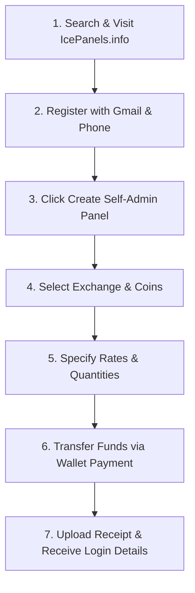

# 🪩 IcePanels - Premium Self-Admin Panel Provision Platform 🚀

🌐 **Official Link:** [https://icepanels.info/](https://icepanels.info/)

Welcome to **Ice Panels**, India's premier, fully automated, self-admin & master panel creation platform! Built on a modern full-stack architecture with a stunning dark-glassmorphic aesthetic, Ice Panels allows users to easily manage, create, and top-up administrative credentials for premium exchange platforms securely—without any fraud, risk, or middleman interference.

---

## 🎨 Home Page UI Mockup

Below is a visual representation of the highly polished, gold-accented, dark-glassmorphic user interface of the IcePanels landing page and dashboard. 


*Design language features deep black canvas gradients (`#000000` to `#1a1a1a`), glowing gold neon accents (`#ffcc00`), glassmorphic panels, and animated feedback.*

---

## ⚡ Core Philosophy & Identity

- **Zero Intermediaries**: Eliminates risky middlemen. Users interact directly with automated systems to create their self-admin panels.
- **24/7 Availability**: Automated instant panel refills, secure deposits, and swift withdrawals available round-the-clock.
- **Next-Gen Aesthetics**: Clean glassmorphism overlays, fluid slide-in and hover transitions, responsive card designs, and vibrant status badges.

---

## 🛠️ Technology Stack

IcePanels utilizes a powerful and scalable full-stack ecosystem:

### 💻 Client Side (Frontend)
- **Framework**: `React 18` + `Vite` (for ultra-fast Hot Module Replacement)
- **Styling**: `TailwindCSS` + `Vanilla CSS Modules` (highly custom components with performance in mind)
- **UI Components**: `Flowbite React` (responsive widgets), `PrimeReact` (advanced UI inputs), `Material UI (MUI)` (sleek SVG icons and typography elements)
- **Slide Carousels**: `react-slick` + `slick-carousel` (for horizontal and square banner announcements)
- **State Management**: React Context (`UserProvider` & `BalanceProvider`) for global authentication, balance updates, and API synchronizations
- **Services**: Firebase Web SDK (Auth helper integration)

### ⚙️ Server Side (Backend)
- **Runtime**: `Node.js` + `Express`
- **Database**: `MongoDB` via `Mongoose ODM`
- **Authentication**: JWT & Local authentication strategies
- **Middlewares**: custom CORS policy configurations, Express file uploads, static file routing, and server-side request verification.

---

## ✨ Features Breakdown

### 👤 User Panel Features
- **💳 Interactive Glass Wallet**: Live-updating wallet balances with beautiful green-glowing balance badges.
- **📥 Instant Deposit/Withdrawal Request**: Interactive modals to place transactions, upload receipt screenshots, and verify payments.
- **🚀 One-Click Self-Admin Creation**: Customized panels configuration where users specify coin amounts, custom transaction rates, and website of choice.
- **📱 Live ID Manager**: Interactive portal displaying website credentials (URL, username, passwords) once approved by the admin.
- **🔄 Account Actions**: Requests to close existing accounts or request quick password changes for security.
- **💬 Direct Support Channels**: Beautifully animated float widgets linking users directly to VIP WhatsApp channels and Telegram support.

### 👑 Admin Panel Features
- **📊 Real-time Dashboard**: Overview of active platform statistics, transaction approvals, and user accounts.
- **📝 ID Request Pipeline**: Interactive dashboard to review user panel requests, assign portal credentials, and approve/reject with automated notes.
- **💼 Transaction Moderation**: View submitted screenshots of bank transfers to quickly approve/reject wallet deposits and process payouts.
- **🖼️ Banner & Carousel Manager**: Upload and sequence horizontal and square banner slide graphics directly to the landing page.
- **👥 User Accounts Audits**: Access, inspect, and modify active user databases, balances, and registered exchange websites.

---

## 🔍 How It Works - The Step-by-Step Flow

The system operates in a highly-structured 7-step automated loop:



1. **Open Google & Visit**: Access the platform through the secure portal at `IcePanels.info`.
2. **Register/Login**: Securely register using your mobile number and Google credentials.
3. **Select Panel**: Navigate to `Panels` -> `Create Panel`.
4. **Choose Platform**: Choose one of the 16+ premium exchanges supported (e.g. Radhe Exchange, King Exchange, Go Exchange, world777, Diamond Exchange).
5. **Set Configuration**: Fill in panel details, desired coins, and rates.
6. **Wallet Payment**: Complete checkout using your pre-funded wallet balance.
7. **Submit Receipt**: Upload payment confirmation. Once the admin verifies, the administrative credentials (URL, Username, Password) appear directly on your home dashboard page.

---

## 📂 Project Structure

```text
icePanels/
├── backend/
│   ├── config/            # DB Connections & config files
│   ├── controller/        # API Controller logics (Auth, Users, ID Requests)
│   ├── models/            # Mongoose Schemas (Transaction, User, WebsiteId, CloseRequest)
│   ├── routes/            # Express API Routes (User, Admin, Auth, Images)
│   ├── uploads/           # User upload directories for transaction screenshots
│   ├── server.js          # Node.js Server entrypoint
│   └── package.json
└── frontend/
    ├── public/            # Static assets
    ├── src/
    │   ├── assets/        # Core image assets, certifications, and logo badges
    │   ├── components/    # Reusable components (Navbar, Popups, Carousels, ID Managers)
    │   ├── context/       # UserContext & BalanceProvider React State
    │   ├── firebase/      # Client-side Firebase configs
    │   ├── hooks/         # Custom React hooks
    │   ├── utils/         # Utility functions
    │   ├── App.jsx        # App component router definition
    │   ├── index.css      # Core Design System, Tailwinds, and custom animations
    │   └── main.jsx       # Client bundle mount point
    ├── tailwind.config.cjs
    └── package.json
```

---

## 🚀 Setup & Installation

Follow these instructions to run the entire system locally.

### 📥 Prerequisites
- **Node.js** (v16.x or higher)
- **npm** or **yarn**
- **MongoDB Database** (Local instance or MongoDB Atlas Cloud Cluster)

---

### 1. Backend Setup ⚙️

1. Navigate to the backend directory:
   ```bash
   cd backend
   ```
2. Install server-side dependencies:
   ```bash
   npm install
   ```
3. Create a `.env` file in the `backend` folder and add your environment variables:
   ```env
   PORT=5000
   MONGO_URI=your_mongodb_connection_string
   JWT_SECRET=your_jwt_secret_token
   CORS_ORIGINS=http://localhost:5173,http://localhost:3000
   ```
4. Start the server in development mode:
   ```bash
   npm run dev
   ```
   *The server will boot up and listen on `http://localhost:5000`.*

---

### 2. Frontend Setup 💻

1. Navigate to the frontend directory:
   ```bash
   cd ../frontend
   ```
2. Install client-side dependencies:
   ```bash
   npm install
   ```
3. Create a `.env` file in the `frontend` folder (if needed to configure custom Firebase variables or API endpoints).
4. Run the local development server:
   ```bash
   npm run dev
   ```
   *Vite will compile and host the page. Click the terminal link (usually `http://localhost:5173`) to launch it in your browser.*

---

## 🏅 Certifications & Responsible Gaming
IcePanels is committed to providing a secure and authenticated environment for its partners and users. The platform integrates:
- **RNG Verified Engine**: Certified Random Number Generation for fair operations.
- **SSL Secure Protocols**: Industry-standard encryption for client-server communication.
- **Responsible Gaming Framework**: Enforces safe parameters, age verification checks (+18 restriction), and support hotlines.

---

*Designed and engineered with passion, premium style, and technical excellence.* 🌟
